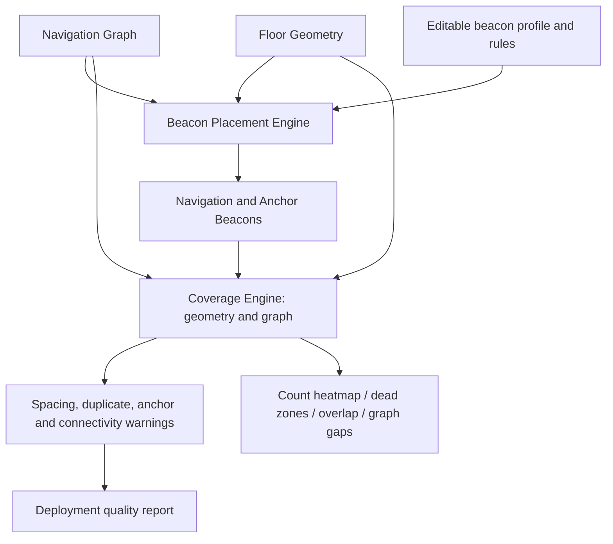

# Beacon placement and coverage algorithms

## Graph-following placement

Placement identifies required anchors and branch/end nodes, then walks unvisited edges into corridor chains. Degree-two graph samples remain part of the chain. A chain chooses an interval count nearest `round(length / desiredSpacing)`, constrained to `[ceil(length / maximumSpacing), floor(length / minimumSpacing)]` when that range is feasible. Beacon coordinates interpolate along the relevant edge. Floor-specific spatial bins deduplicate junctions and relocated generated positions. Closed cycles receive a starting beacon. Floor transition nodes receive anchors; no beacon is inserted vertically between floors.

The default target is 5.5 m with configured targets limited to 5–6 m. Same-floor edges must have a physical distance matching their straight-line world geometry (within 1 mm or 0.1%); zero-span edges are rejected. Arbitrary routing weights cannot be used to fabricate physical spacing. Curved corridors need intermediate graph vertices rather than an inflated distance on a straight edge. Cross-floor connector distances remain explicit and are exempt from this straight-line check. Mandatory anchors and short branches can make spacing infeasible; the planner retains safe anchors and emits spacing/chain warnings rather than hiding exceptions. Walls or restricted regions can make the graph itself invalid, which is reported independently.

Manual/hybrid recalculation preserves submitted records and disabled states. Dragged/inserted positions initially snap to nearby same-floor graph edges. The engine reconciles every active beacon's node/edge reference against its coordinates, so stale offsets cannot fabricate coverage. Off-graph or conflicting positions relocate to the nearest valid same-floor graph position; there is no arbitrary maximum relocation distance, and movements are warned. Mounting edits survive recalculation. Applying a profile updates planning radius and profile ID; explicit per-beacon mounting metadata stays intact.

## Geometry safety

Floor geometry uses metres. Drawing geometry is rotated around its bounds centre before pixel-to-metre conversion. Width/height must imply a consistent scale, and graph world coordinates must agree with drawing coordinates. Boundaries, walkable polygons, width-buffered paths, restricted polygons, non-walkable polygons and thickness-buffered walls are floor-specific. Invalid/self-intersecting/zero-area polygons and invalid widths are rejected.

A point must lie inside a building boundary and inside the union of walkable areas/path buffers, while outside every wall/restricted/non-walkable region. Missing boundary or walkable geometry fails closed. Segment intervals are split at polygon boundaries and wall/path capsule boundaries; classifying interval midpoints finds even very thin obstacles without an arbitrary placement sampling grid. Nearest valid relocation projects onto each valid graph interval and compares valid graph nodes. The tiny inward offset at forbidden interval endpoints avoids placing a device exactly on a blocked border. If no safe graph position exists, omit the active beacon and cap overall quality at zero.

## Coverage models and accuracy

Placement provides an inexpensive geometry-clipped **graph-distance** radius estimate. Radius propagation does not traverse blocked edge intervals or change floors. Spacing is measured along continuous chains rather than between every graph sample.

Milestone 5 separately computes **Euclidean radius plus geometric line-of-sight** over walkable area and graph edges. A solid wall, restricted/non-walkable region, or outside-building segment blocks visibility completely. This is a conservative geometric planning model, not wall attenuation or RF propagation. Disabled/invalid beacons are excluded. Beacons on another floor contribute nothing. RSSI threshold, TX power and advertisement interval do not alter results; they are saved metadata only.

Area samples are cell centres, default 0.5 m. Each valid centre counts visible beacons within radius. Count 0 = dead; 1 = singly covered; 2+ = overlap. Covered area is a union (never counted twice); overlap is a separate statistic. Four-neighbour flood-fill groups dead-zone cells, checking geometric visibility between neighbours so a thin wall cannot join disconnected zones. Area, zone bounds and percentages are approximate at the reported resolution, including fractional boundary cells; they are not exact polygon areas.

Graph edges are sampled at up to 0.25 m intervals, with exact valid-geometry interval endpoints inserted so thin wall/restriction gaps cannot vanish between samples. Uncovered intervals become gap records in metres with drawing endpoints. Radius/visibility coverage transitions remain sampling estimates. Multi-floor connector lengths are excluded from floor-area and same-floor graph coverage; each floor landing requires its own beacon.

Area bounding grids target roughly 40,000 cells across floors. Long graph analyses target roughly 100,000 regular samples, plus one per edge and geometry cut points. Large inputs coarsen resolution with explicit warnings. Floor-specific spatial bins limit beacon candidate scans; the UI caches one raster image per selected floor rather than rendering each cell as a React object. Nearest relocation scans the same-floor graph only when a beacon needs correction. Polygon and line-of-sight cost still scales with geometry complexity; benchmark results are not an RF accuracy or SVG performance guarantee.

## Deployment quality (transparent planning heuristics)

- Spacing score: percentage of measured consecutive beacon gaps within the configured range, multiplied by the fraction of non-duplicate beacon records. No measured gaps scores 100 only if an active beacon exists; an empty deployment scores zero.
- Placement coverage score: covered graph length / same-floor graph length. Full coverage analysis replaces it with the lower of walkable-area and graph coverage percentages.
- Connectivity score: largest weak graph component's share of nodes, multiplied by the fraction of beacon links within maximum spacing and the fraction of graph edges not blocked by geometry. An empty active deployment scores zero. This is a structural heuristic, not directed route reachability or a radio mesh test.
- Anchor placement score: required anchor locations with an enabled Anchor beacon within 1 m / required locations. Original anchor IDs survive relocation. Missing anchors produce warnings.
- Overall score: equal mean of the four scores, bounded 0–100. Unresolved geometry failures cap it at zero. Every reduced component emits a warning. Overlap is informative and is not penalized by itself.

These scores are review aids, not manufacturer-certified deployment criteria. No automatic square-grid fill, RF propagation, RSSI simulation, antenna pattern, survey inference or field certification is implied.

## Profiles, mounting and saved layouts

Profiles use editable assumptions, not verified IW data sheets. Custom profiles store spacing, radius, mount type, height and RSSI threshold. Ceiling/Wall/Outdoor names do not imply certified RF behaviour; Outdoor defaults to Pole installation. Each beacon carries installation type, mounting height, optional orientation, notes and status. Physical installation clearance, ceiling load, wiring, surface availability and antenna behaviour require site review beyond the 2D geometry model.

Named snapshots clone beacon plans and profiles into the project record. Save updates the selected snapshot; Save as new creates an independent one. Reload preserves the snapshot, clears prior coverage, and requires review if graph/geometry/calibration changed. Duplicate does not alter the working layout. Delete removes only the named snapshot, not the working beacons; undo can restore it until a browser reload clears history. Graph or floor edits invalidate coverage immediately.

## Milestone 6 incremental planning

`DeploymentPlanner` preserves beacon IDs and explicit positions through edits. Only Generate runs automatic layout generation; hybrid generation retains manual and locked records. Move/Insert finds the nearest valid same-floor graph position. Locks protect movement/deletion/recalculation, not metadata edits. Invalid locked/off-graph records remain visible with warnings and cap quality at zero; they are not silently removed.

Placement validation caches corridor chains bounded by same-floor junctions/endpoints. A node beacon belongs to every incident chain; an edge beacon belongs to its chain. Selected edits invalidate old/new memberships. Floor/project recalculation revalidates unlocked records in scope, avoiding nearest-position searches for already valid attachments. A very long degree-two corridor still requires a whole-chain spacing check; finer chain-prefix aggregates are the upgrade if that becomes limiting.

Incremental coverage recomputes cells only within changed beacons' old/new selected-radius discs, and samples only graph edges whose segments intersect those discs. Radius/enable/delete/insert changes update the union correctly; metadata-only edits reuse all counts. Dead-zone grouping is rebuilt for affected floors because removing coverage can merge/split zones beyond the local disc. Full analysis remains the oracle used by regression tests. Changing threshold/resolution forces full coverage sampling; cost/currency/mode/spacing changes reuse geometric coverage.

Reliable, marginal and nominal radius thresholds select which geometric disc is counted. They have no RF/RSSI meaning. Inspector contribution is sampled walkable area with count 1 inside the selected beacon's visible disc; footprint also includes overlap. Disabled/invalid beacons contribute zero. Installation cost is enabled count × configured unit cost, not a hardware quote.

Versions clone layout/settings/analyzed summaries. Comparison exposes metric deltas and geometry mismatches. CSV quotes fields and escapes formula-leading text; JSON labels world/drawing units. PNG rasterizes the current viewport, including the floor-plan preview, graph, objects and visible deployment layers. Export is not RF certification.

Run `node scripts/deployment-demo.mjs` for reproducible edit/version/export results and scoped work counters. The 101×101 grid benchmark has 10,201 nodes, 20,200 edges and 10,201 beacons. A selected node edit touches four corridor regions and roughly sixteen cells/edges. Timing covers engine analysis, not browser serialization, initial SVG paint or field accuracy; analysis runs in a worker and pending previews are coalesced rather than building an unbounded drag queue.

## Reproducible sample

Run `npm run check`, `node scripts/beacon-demo.mjs`, and `node scripts/coverage-demo.mjs`. The latter writes `reports/milestone-5-demo.json` and two SVG diagrams under `screenshots/`. The hand-modelled Milestone 2 sample has 17 beacons (5 anchors), average spacing 5.31 m, 38.2% walkable coverage, 100% graph coverage, 5 dead zones totalling 1493.5 m², and 669 m² overlap. Quality is 65.8/100; infeasible spacing and broad uncovered areas remain visible. A controlled three-disabled-beacon comparison exposes one 11.5 m graph gap and 86.5% graph coverage. This is a sample, not a surveyed/supplied mall deployment verification.
