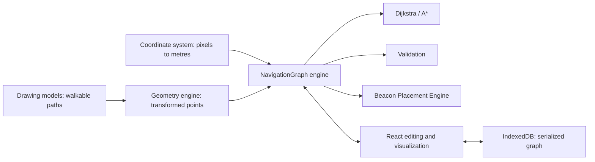
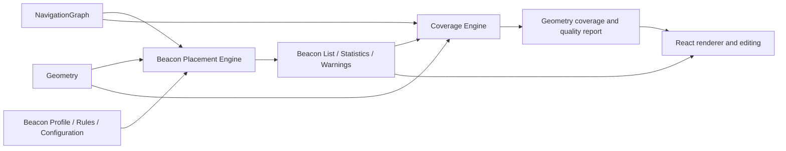
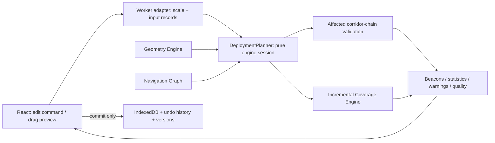

# INPS architecture

The NavigationGraph module is plain JavaScript and has no React, DOM, or storage imports. Nodes retain drawing coordinates in pixels (`x`, `y`) and calibrated coordinates in metres (`worldX`, `worldY`). Floor IDs must use a consistent building coordinate origin when connecting floors. Connector distances are explicit measured travel distances; the initial UI value of 3 m must be edited to match the building.

Graph state serializes as node and edge arrays. The engine builds Maps for node lookup, edge lookup, adjacency, and spatial snapping. Routing uses a binary minimum heap. A* scales its Euclidean lower bound to actual edge costs, including lift preferences, to preserve optimality with custom connector distances. `totalDistance` always reports physical edge distance; lift preference changes route selection cost only.

Editing commands create/delete/move nodes, connect/disconnect, split edges, merge compatible degree-two chains, and merge coincident nodes. Direction and accessibility survive splitting and compatible merging. Snapping is floor-specific. Validation distinguishes graph components from directed reachability; a directed destination can still be unreachable within one component.

Walkable path generation transforms rotated geometry, splits intersections and overlapping endpoints, retains path vertices, and inserts nodes every 2.5 m by default. It replaces the current graph; undo restores the previous graph. Automatic generation currently uses pairwise segment comparisons. The large-graph benchmark measures graph indexing, routing, and validation, not path generation or SVG rendering.

POIs can reference `metadata.nodeId`; otherwise the route panel chooses the nearest same-floor node. This fallback does not establish safe passage through a wall. Verify explicit entrances before deployment. Walking estimates use 1.35 m/s and exclude lift waiting time. Future placement must consume the validated graph and calibrated geometry, never infer beacon positions from React state.

Calibration is required before graph creation. Recalibrating an existing drawing requires regenerating/reviewing its graph; stored world coordinates and measured connector distances are intentionally explicit. Multi-floor routing exists in the engine; the editor currently overlays floor connectors in one drawing workspace rather than managing separate floor-plan files.

Milestone 4 implements `planBeacons({ graph, floorGeometry, profile, placementRules, configuration })`. It returns beacon records, graph-distance coverage, warnings, and statistics without accessing React, DOM or IndexedDB. The UI stores the returned plan through existing history and persistence. Manual adjustment calls the same engine with the adjusted list; it does not silently regenerate the plan.

`floorGeometry.js` provides polygon/capsule predicates, exact valid edge intervals, nearest valid graph positions and geometric visibility. It depends only on geometry math. `geometryForProject` adapts pixel drawing models to metre inputs and checks calibration consistency. Explicit `floorId` assigns geometry scope; old objects without one belong to the first graph floor (or `floor-1`), never every floor. Descriptive room `floor` names do not replace graph floor IDs.

Placement and coverage receive only serialized graph, compiled drawing geometry, profiles/rules and configuration. No engine reads React state, DOM, files or IndexedDB. The coverage engine returns plain data: sample cells, floor summaries, dead-zone components, graph gaps, percentages, warnings and quality scores. The UI is an adapter/renderer only.

Milestone 6 adds `DeploymentPlanner`, a pure engineering session that owns disposable caches. `deploymentWorker.js` runs it outside the UI thread. Its inputs remain graph, floor geometry, profiles, settings, beacon records and POI coordinates—not a React project. `useDeploymentPlanner` is the UI adapter: it validates scale, sends commands, coalesces pending drag previews, serializes normal commands and rejects stale geometry responses. Only pointer release commits a drag to history/persistence. Undo, version reload and changed engine inputs rebuild the worker session.

Graph edges are partitioned into same-floor corridor chains bounded by junctions/endpoints, retaining degree-two vertices and closed cycles. Junction-node edits invalidate all incident chains. Active anchors are matched globally with spatial bins, so anchor correctness is not limited to one chain. Placement/coverage regions are distinct: coverage updates old/new radius discs and potentially intersecting graph edges. Unchanged floors and outside-radius cells/edges are reused; dead-zone connected components are regrouped only on affected floors. Global rule/resolution changes invalidate the relevant caches. Quality totals are aggregated from cached chains and current coverage.

Area cells are rasterized into a memoized image in the React overlay. Graph JSX and unchanged drawing shapes are memoized so beacon edits do not reconstruct the graph scene. Coverage floor selection still does not introduce a separate multi-floor drawing manager; existing floor drawings remain overlaid as before.

Working layouts, profiles, planning settings, view toggles and named versions live in the project record. Snapshot models use structured clones so later edits cannot mutate saved layouts; versions retain applied settings and analyzed summaries. A compact graph/geometry/calibration signature flags mismatched reloads. Graph/geometry/scale changes invalidate coverage and flag placement for review. IndexedDB saves resolve after transaction completion. Milestone 6 adds no dependency or backend (PDF.js was added separately for PDF rendering).

Large-graph benchmarks remain engine benchmarks, not a guarantee of 10,000-node SVG rendering. Nearest valid relocation checks all same-floor graph positions when conflicts occur; coverage uses floor-specific beacon spatial bins and bounded raster/graph sampling. Physical accuracy depends on the supplied geometry and calibration.
